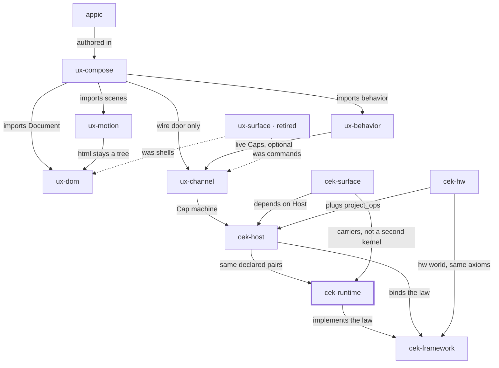

# Place in the stack

**You are here:** `cek-runtime` in [bitplorer/cek-runtime](https://github.com/bitplorer/cek-runtime).

The reference kernels. No ambient power. The peer never mints a root Cap. cek-contract holds the declared pairs. Python cek_host.catalog binds those same pairs.

The picture is the same in every repo. The thick stroke is this library. A missing line is a missing door, not a forgotten one. Dashed lines are history.

## Owns

cek-contract, the host kernel, the peer kernel, the baseline and ui drivers, and the hops onto them (Rust, WASM, PyO3, CLI).

## Refuses

A peer that mints. A third kernel between decide and apply.

## Install

Cargo workspace. Not a Python import.

## Doors

### Uses

- [cek-framework](https://github.com/bitplorer/cek-framework) — implements the law

### Used by

- [cek-host](https://github.com/bitplorer/cek-python) — same declared pairs
- [cek-surface](https://github.com/bitplorer/cek-python) — carriers, not a second kernel

## The stack

## The walk

Mint, intent, verify, project, apply, undo.

1. **Mint.** Host mints a Cap. The subject on the Cap is the subject in the args. dev is the workshop. prod refuses the workshop secret.
2. **Intent.** Channel carries action, args, and cap. That is the click. It is not a form post.
3. **Verify.** **This library.** Host verifies the Cap before any shared-world write. A bad Cap, or a store that is down, refuses. ops is empty. The peer never mints.
4. **Project.** Only declared pairs leave the host. Baseline and ui.dom are the catalog. Hardware pairs arrive through project_ops. They are not a fork of Host.
5. **Apply.** The peer applies the ops. DOM is one world. GPIO is another. Surface carries the IR. It does not decide.
6. **Undo.** Lineage records the cause. End or revoke reverses it, or the op is marked non-reversible. A trace id never grants permission.

This library is step 3 of the walk.

## Notes

- Verify, then dispatch, then lineage, then project.
- The Python host and this contract must name the same pairs.
